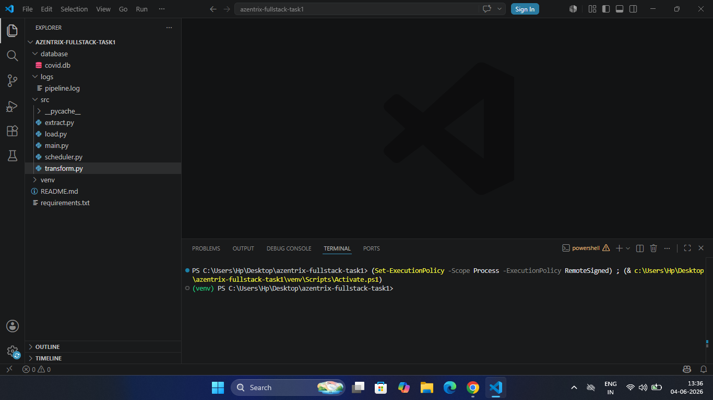
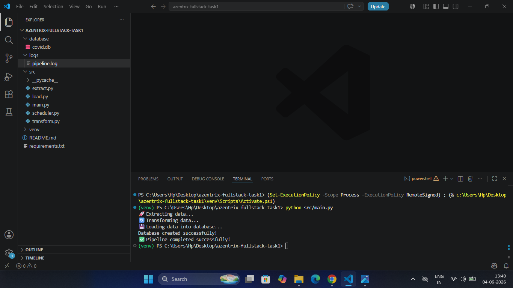
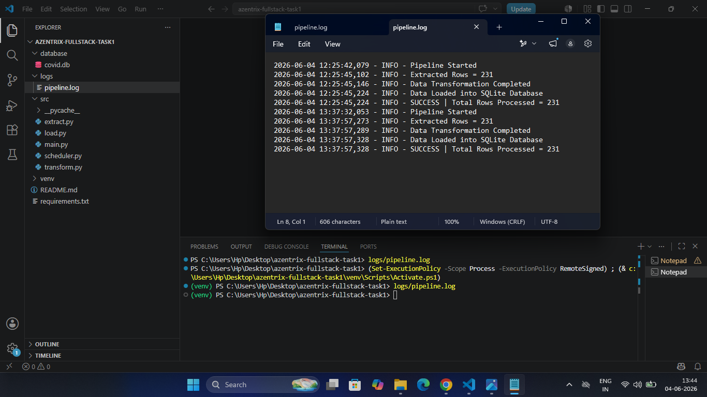
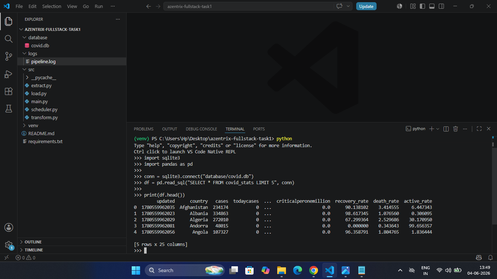

🦠 COVID-19 ETL Data Pipeline

## Repository Name

**azentrix-fullstack-task1**

---

## Project Overview

This project implements a Python-based ETL (Extract, Transform, Load) pipeline that fetches real-time COVID-19 country statistics from a public API, transforms and cleans the data, and stores the processed results in a SQLite database.

The project also includes logging and automated scheduling using APScheduler.

---

## Features

* Extract real-time COVID-19 data from a public API
* Transform and clean raw data
* Store processed data in SQLite database
* Generate execution logs
* Automated scheduling using APScheduler
* Modular ETL architecture

---

## Project Structure

text
azentrix-fullstack-task1/
│
├── src/
│   ├── extract.py
│   ├── transform.py
│   ├── load.py
│   ├── main.py
│   └── scheduler.py
│
├── database/
│   └── covid.db
│
├── logs/
│   └── pipeline.log
│
├── screenshot/
│   ├── 01_project_structure.png
│   ├── 02_pipeline_execution.png
│   ├── 03_sqlite_database_output.png
│   └── 04_pipeline_logs.png
│
├── requirements.txt
└── README.md

---

## ETL Workflow

### Extract

Fetches COVID-19 country statistics from a public API.

### Transform

Cleans and processes the raw data before storing it.

### Load

Stores the transformed data into a SQLite database.

---

## Installation

Create and activate virtual environment:

bash
python -m venv venv
venv\Scripts\activate

Install required packages:

bash
pip install -r requirements.txt

---

## Run The Project

Run ETL Pipeline:

bash
python src/main.py

Run Scheduler:

bash
python src/scheduler.py

---

## Screenshots

### Project Structure

### Pipeline Execution

### Database Output

### Logs Output

---

---

## GitHub Repository
**Repository Name:** azentrix-fullstack-task1
Repository Link:
https://github.com/shubham101-web/azentrix-fullstack-task1

---
## Loom Video

Loom Video URL:
https://www.loom.com/share/da5448f8526144288cad846da1f31bf9
---

## Technologies Used

* Python
* Pandas
* Requests
* SQLite3
* APScheduler
* Logging

---

## Submission

This project was completed as part of the Azentrix Full Stack Developer Assessment.

**Repository Name:** azentrix-fullstack-task1